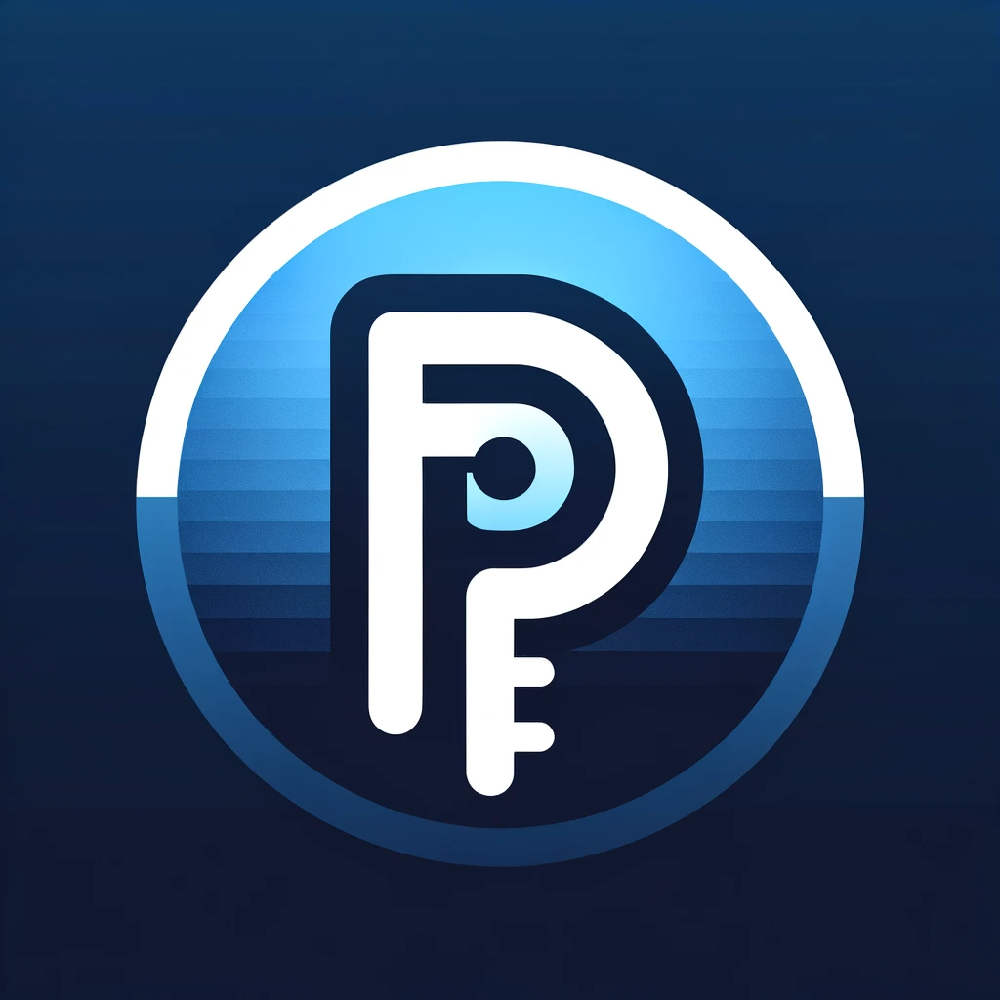

# FDP Converter

FDP Converter adalah alat yang memungkinkan Anda mengonversi file JSON ke format file sesuai yang anda inginkan yang dilengkapi enkripsi. Ini memberikan lapisan keamanan tambahan untuk data Anda saat membagikannya atau menyimpannya.

## 🌟 Fitur

- **Konversi Cepat**: Ubah file JSON Anda ke format FDP hanya dalam beberapa detik.
- **Keamanan Tinggi**: File JSON Anda akan dienkripsi sebelum dikonversi.
- **Kustomisasi**: Anda dapat menyesuaikan nama file output sesuai kebutuhan Anda.

## 📋 Prasyarat

Sebelum menggunakan FDP Converter, pastikan Anda memiliki:

- File dengan format `.json`.
- Node.js dan NPM terinstal pada sistem Anda.

## 🚀 Cara Menggunakan

1. Clone repositori ini atau unduh kode sumber.
2. Jalankan `npm install` untuk menginstal semua dependensi yang diperlukan.
3. Mulai server dengan menjalankan `node app.js`.
4. Buka browser Anda dan kunjungi `http://localhost:1212/uploadform` untuk mengakses form upload.
5. Unggah file JSON Anda dan tunggu hingga konversi selesai.
6. File FDP akan disimpan dengan nama default `output.fdp`, namun Anda dapat mengkustomisasinya sesuai kebutuhan Anda dalam kode.

## 🛠️ Kustomisasi Nama File

Jika Anda ingin mengkustomisasi nama file output:

- Buka `app.js`.
- Cari baris `fs.writeFileSync('output.fdp', encryptedData);`.
- Gantilah `'output.fdp'` dengan nama file yang Anda inginkan.

## 📄 Lisensi

Distribusi di bawah lisensi MIT. Lihat `LICENSE` untuk informasi lebih lanjut.

---

Harap sesuaikan konten di atas sesuai dengan kebutuhan dan preferensi Anda, terutama bagian seperti lokasi logo atau informasi lisensi jika berbeda. Pastikan juga untuk menyediakan informasi tambahan yang mungkin Anda anggap penting bagi developer lain.